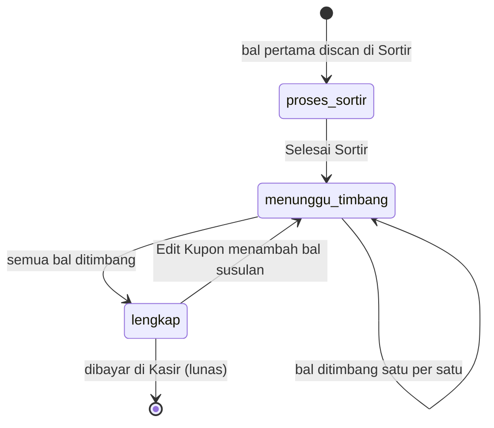
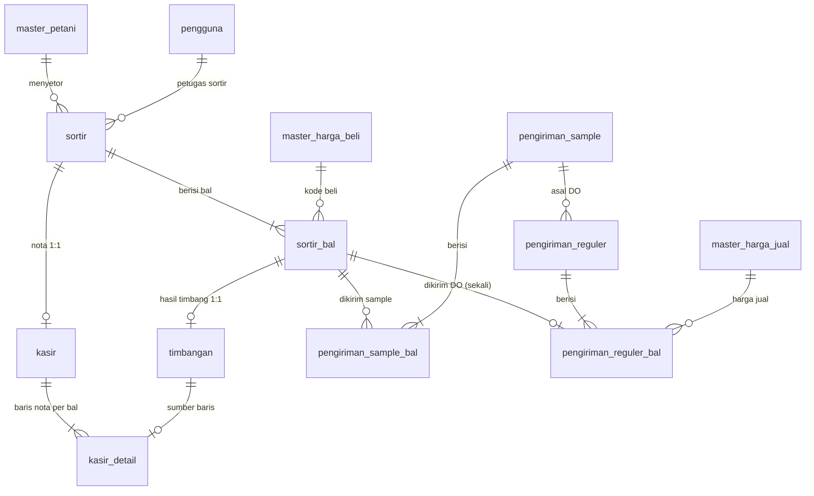

# Dokumentasi Database & Sinkronisasi Data

Tanggal: 2026-09-20 · Berlaku untuk: frontend v3.0.x (repositori ini) dan backend Laravel + PostgreSQL (repositori terpisah).

Dokumen ini menjelaskan bagaimana data kupon, bal, timbangan, dan pembayaran mengalir dari layar ke
database, apa yang harus dijamin database, dan bagaimana mencari, menambah, mengurangi, memproses,
serta menampilkan data secara efisien. Isinya disusun dari keluhan pemakaian produksi 3 hari pertama.

> **Batas pengetahuan dokumen ini.** Repositori backend tidak ada di sini. Bagian "Kontrak API" ditulis dari
> kode frontend (yang pasti benar untuk sisi FE). Skema tabel mengacu pada ERD target
> `ERD Sekar Maju Sejahtera ERP.txt` (format dbml, PostgreSQL) yang berada di luar repositori. Nama tabel
> produksi yang sebenarnya perlu dicocokkan dengan ERD itu sebelum menjalankan SQL di
> `db/usulan-indeks-constraint.sql`. Bagian yang berupa dugaan diberi tanda **[dugaan]**.

## Daftar isi

1. [Ringkasan temuan 3 hari pemakaian](#1-ringkasan-temuan-3-hari-pemakaian)
2. [Alur data dan status](#2-alur-data-dan-status)
3. [Relasi antar tabel](#3-relasi-antar-tabel)
4. [Pemetaan field layar ke kolom database](#4-pemetaan-field-layar-ke-kolom-database)
5. [Kontrak API yang dipakai frontend](#5-kontrak-api-yang-dipakai-frontend)
6. [Aturan wajib di sisi server](#6-aturan-wajib-di-sisi-server)
7. [Pola query per kebutuhan](#7-pola-query-per-kebutuhan)
8. [Indeks dan constraint yang diusulkan](#8-indeks-dan-constraint-yang-diusulkan)
9. [Pemeriksaan integritas data](#9-pemeriksaan-integritas-data)
10. [Keandalan sinkronisasi di frontend](#10-keandalan-sinkronisasi-di-frontend)
11. [Daftar periksa migrasi VPS](#11-daftar-periksa-migrasi-vps)
12. [Peta kode frontend](#12-peta-kode-frontend)

---

## 1. Ringkasan temuan 3 hari pemakaian

| # | Keluhan | Status | Penyebab | Perbaikan |
|---|---------|--------|----------|-----------|
| 1 | Tidak bisa tambah petani baru | Selesai (sebelumnya) | Alamat wajib diisi padahal opsional | Alamat/HP dibuat opsional |
| 2 | Input timbang tidak tersimpan | Diperbaiki | Lihat 2a–2c | Antrean sinkron, verifikasi hasil, alur fokus |
| 3 | Centang ganti tikar tidak tersimpan di DB, kadang aman kadang tidak | Diperbaiki | Lihat 2a–2c | Antrean sinkron + verifikasi ganti tikar |
| 4 | Bal ketinggalan saat sortir | Selesai (sebelumnya) | Kupon tertutup tak bisa ditambah bal | Fitur Edit Kupon |

**Akar masalah keluhan 2 dan 3** (kode lama, `erpApi.ts` dan `App.tsx`):

- **2a. Kegagalan simpan ke server ditelan diam-diam.** `syncTransaksi` menangkap semua galat lalu
  mengembalikan `fromBackend: false`. Data hanya tersimpan di penyimpanan lokal peramban, **tanpa percobaan
  ulang dan tanpa tanda apa pun di layar**.
- **2b. Data server menimpa data lokal.** Saat login dan setiap kali laporan dibuka,
  `refreshOperationalLists` memuat daftar kupon dari server lalu **mengganti** data lokal
  (`setTransaksiList(server)` dan `saveTransaksiData(server)`). Perubahan yang belum sampai ke DB, misalnya
  centang ganti tikar, ikut terhapus. Inilah "statusnya kembali tidak GT".
- **2c. Cek kesehatan server terlalu sempit dan permintaan bisa bertabrakan.** Cek `/health` hanya menunggu
  3 detik; sekali gagal, semua simpanan 10 detik berikutnya langsung dianggap offline (VPS baru lebih lambat
  bangun). Simpanan beruntun ke kupon yang sama juga dikirim bersamaan, sehingga salinan lama bisa tiba
  terakhir di server dan menimpa yang baru.
- **2d. Pola waktu yang cocok dengan gejala.** Hari 1 terjadi, hari 2 aman, hari 3 (setelah migrasi VPS)
  terjadi lagi: konsisten dengan server yang kadang lambat atau tidak terjangkau (2c) atau sesi login yang
  tidak berlaku lagi setelah migrasi, dikombinasikan dengan 2a dan 2b. Detail migrasi ada di
  [bagian 11](#11-daftar-periksa-migrasi-vps).
- **2e. Input berat dibuang pengaman anti-scan.** Dua angka yang diketik lebih cepat dari 45 ms (numpad cepat)
  dikira tembakan scanner dan beratnya dibuang. Sekarang hanya huruf/simbol atau 6 angka berturut-turut yang
  dianggap scanner.

---

## 2. Alur data dan status

Alur bisnis: **Master Petani → Sortir → Timbangan → Kasir → Pengiriman**. Sortir dan Timbangan boleh berjalan
paralel pada kupon yang sama, karena bal langsung tersimpan sejak discan.



- `status_tahap` kupon dihitung dari bal, bukan diketik: bila masih ada bal berat 0 maka `menunggu_timbang`,
  bila semua berat > 0 dan sortir sudah ditutup maka `lengkap` (`hitungUlangKupon`, `utils/kuponSortir.ts`).
- **Pembayaran terpisah dari tahap.** Kupon lunas hanya bila dibayar di Kasir
  (`status_pembayaran = 'lunas'` atau `metode_pembayaran = 'cash'`). Bayar hanya boleh bila semua bal sudah
  ditimbang. Kupon lunas tidak bisa diedit (tambah, ubah, hapus bal).
- **Status stok bal:** `proses_sortir` (belum ditimbang) → `di_gudang` (sudah ditimbang) →
  `terkirim_sample` / `keluar` (sudah dikirim lewat Surat Jalan; tidak boleh dihapus lagi).
- **Nilai aset dan valuasi hanya dari kupon lunas.** Jumlah bal (rekap kode, stok) menghitung semua kupon.

---

## 3. Relasi antar tabel

Ringkasan dari ERD target. Kunci utamanya: **satu kupon = satu `sortir`; satu bal = satu `sortir_bal`; satu
hasil timbang = satu `timbangan` (1:1); satu nota = satu `kasir` (1:1 dengan kupon)**.



**Aturan penghapusan** (dari ERD): bal cascade ke `timbangan`, `kasir_detail`, dan `pengiriman_sample_bal`;
tetapi `pengiriman_reguler_bal.sortir_bal_id` **RESTRICT**, jadi kupon dengan bal yang sudah dikirim DO
tidak bisa dihapus. Frontend menampilkan penguncian yang sama (`utils/kunciHapus.ts`).

**Kunci alami yang dipakai layar dan harus unik di database:**

| Kunci | Contoh | Tabel | Catatan |
|-------|--------|-------|---------|
| `no_kupon` | `KUP0012` | `sortir` | unik, diketik operator |
| `no_bal` | `SB0001`, `HF0001`, `TS1`, `T1` | `sortir_bal` | unik **global**; selalu huruf besar tanpa strip |
| `kode_petani` | `PTN-2026-001` | `master_petani` | unik |
| `no_surat_jalan` / `no_surat_sample` | `SJ-PJM0001` | `pengiriman_*` | diisi manual, tolak kembar |

Format nomor bal: kode huruf `SB|HF|TS|T` diikuti urutan; `SB` dan `HF` biasanya 4 angka berlapis nol,
`TS` dan `T` tanpa nol di depan. Kode bal (awalan huruf) dipakai untuk aturan tara dan rekap laporan.

---

## 4. Pemetaan field layar ke kolom database

Model layar: `TransaksiPembelian` dan `TransaksiItemBal` (`src/types/index.ts`).

| Field layar | Kolom ERD target | Catatan / kesenjangan |
|-------------|------------------|-----------------------|
| `transaksi_id` (`TRX-DDMMYYYY-NNN`) | (belum ada) | Dipakai sebagai kunci di URL `/transaksi/{id}`. ERD memakai `sortir_id` integer. **Usulan:** kolom `sortir.kode_transaksi varchar(30) unique` |
| `no_kupon` | `sortir.no_kupon` | unik |
| `petani_id` (`PTN-…`) | `master_petani.kode_petani` → `sortir.master_petani_id` | FE mengirim kode, server memetakan ke id |
| `tanggal_transaksi` | `sortir.tanggal_sortir` | tipe `date` |
| `status_tahap` | `sortir.status_tahap` | enum `proses_sortir / menunggu_timbang / lengkap` |
| `status_pembayaran`, `metode_pembayaran`, `dibayar_oleh`, `dibayar_pada` | `kasir.*` | baris `kasir` baru ada saat nota dibuat |
| `items[].item_id` | `sortir_bal.sortir_bal_id` | FE membuat `BAL-ITEM-<ms>-<n>`, server `{TRX}-BAL-nn`; dicocokkan lewat `no_bal`. **Usulan:** `sortir_bal.client_item_id unique` agar kiriman ulang idempoten |
| `items[].no_bal` | `sortir_bal.no_bal` | unik global |
| `items[].barcode` | (belum ada) | biasanya sama dengan `no_bal`. Bisa dihapus dari payload atau dibuat kolom |
| `items[].kode_bal_pembeli` | hanya di `pengiriman_sample_bal` | belum ada pada bal pembelian |
| `items[].kode_grade` + `harga_per_kg` | `sortir_bal.master_harga_beli_id` (+ `kasir_detail.harga_beli_per_kg`) | **Kesenjangan:** harga baru disalin saat nota dibuat. Layar menampilkan harga sejak sortir, jadi perubahan master harga di antaranya bisa menggeser nilai. **Usulan:** simpan `harga_beli_per_kg` sejak `sortir_bal` dibuat |
| `items[].ganti_tikar`, `potongan_tikar` | `sortir_bal.ganti_tikar`; `kasir_detail.potongan_tikar` | tikar dicentang di Timbangan sebelum nota ada: nilainya harus ditulis ke `sortir_bal` |
| `items[].berat_bruto_kg`, `potongan_tara_kg`, `berat_kg`, `is_netto_manual` | `timbangan.*` | satu baris per bal setelah ditimbang; berat 0 = belum ada baris |
| `items[].potongan_kuli`, `potongan_tali` | `kasir_detail.potongan_kuli / potongan_tali` | konstanta 7.000 dan 3.000 per bal di FE (`config/aturanTimbang.ts`). **Usulan:** tabel tarif berlaku per tanggal, disalin per bal |
| `items[].lokasi_simpan` (`Blok A`) | (tidak ada) | sistem hanya satu gudang; boleh dibuang dari payload |
| `items[].diubah_lokal_pada` | (tidak ada) | penanda waktu FE untuk gabung data. Padanannya di server: `updated_at` / `versi` |

Aturan hitung (sumber tunggal di FE, harus sama di server):

```
tara       : SB = 2 kg; HF/lainnya bruto <50 = 3, 50-59 = 5, >=60 = 6; TS/T <50 = 4, 50-59 = 5, >=60 = 6
netto      = bruto - tara            (kecuali is_netto_manual = true)
total_kotor per bal = netto x harga_beli_per_kg
potongan per bal    = kuli (7.000) + tali (3.000) + tikar (75.000 bila ganti tikar)
subtotal_bersih     = total_kotor - potongan
Nilai Kotor (laporan pembelian) = Nilai Beli + Tali + Kuli + Tikar
```

---

## 5. Kontrak API yang dipakai frontend

Semua di bawah `/api/v1`, JSON, `Authorization: Bearer <token Sanctum>`. Batas waktu permintaan di FE 15 detik.

| Metode & rute | Dipakai untuk | Isi penting |
|---------------|---------------|-------------|
| `GET /health` | cek server hidup (batas 6 detik) | `{status:"ok"}` |
| `POST /auth/login` | masuk | `token`, `user` |
| `GET /petani`, `POST /petani`, `PUT /petani/{id}`, `DELETE /petani/{id}` | master petani | |
| `GET/POST /master/harga-beli`, `GET/POST /master/harga-jual` | master harga (POST = upsert) | |
| `GET /transaksi` | daftar kupon **beserta `items`** | dimuat saat login dan buka laporan |
| `POST /transaksi/sortir` | membuat kupon baru | `transaksi_id, no_kupon, petani_id, tanggal_transaksi, items[]` |
| `PUT /transaksi/{id}/sortir-items` | mengganti daftar bal kupon yang ada (tambah, ubah, hapus) | `status_tahap`, `items[]` lengkap |
| `PUT /transaksi/{id}/timbang` | menyimpan hasil timbang dan ganti tikar | `items[]` dengan `berat_*`, `ganti_tikar`, `potongan_tikar` |
| `PUT /transaksi/{id}/bayar` | pelunasan Kasir | `metode_pembayaran`, `catatan_kasir` |
| `PUT /transaksi/{id}/koreksi` | koreksi kasir lama (tidak dipakai UI lagi) | |
| `GET /barang`, `PUT /barang/{id}/status` | stok bal | |
| `GET/POST /sample-batch`, `PUT /sample-batch/{id}` | pengiriman sample | |
| `GET/POST /pengiriman` | Surat Jalan (DO) | |
| `GET /dashboard/stats` | ringkasan dashboard | |
| `GET/POST/PUT /users…` | manajemen pengguna | |

**Urutan panggilan untuk satu simpanan kupon** (dikerjakan `ErpApiService.syncTransaksi`, dipanggil oleh
antrean sinkron): kupon baru = `POST sortir` → `PUT timbang` bila ada bal ditimbang; kupon ada =
`PUT sortir-items` → `PUT timbang`; baru dibayar = kedua langkah itu (jika ada) lalu `PUT bayar`.
Bila `sortir-items` menjawab 404 (kupon lama yang dulu hanya tersimpan lokal), FE otomatis beralih ke
`POST sortir`; bila `POST sortir` menjawab duplikat (409/422 "sudah ada"), FE beralih ke `sortir-items`.

---

## 6. Aturan wajib di sisi server

Ini yang membuat keluhan "kadang tersimpan kadang tidak" tidak muncul lagi dari sisi backend. FE sudah
mengirim ulang dan memverifikasi, tetapi server harus mendukungnya.

1. **PUT bersifat idempoten dan berupa keadaan penuh.** Mengirim payload yang sama dua kali tidak boleh
   mengubah hasil atau membuat baris ganda. Dasarnya `no_bal` (unik) dan `client_item_id`.
2. **`ganti_tikar` dan `potongan_tikar` ditulis dalam transaksi database yang sama dengan berat**, di
   `PUT timbang` **dan** `PUT sortir-items`. Nilai `false/0` yang dikirim berarti mematikan, jangan diabaikan.
3. **Jawaban selalu memuat `items` lengkap** dengan `no_bal, kode_grade, ganti_tikar, potongan_tikar,
   berat_bruto_kg, berat_kg`. FE mencocokkannya dengan yang dikirim; selisih dianggap tidak tersimpan
   dan dikirim ulang (lihat bagian 10). Jawaban `bayar` sebaiknya juga memuat `items`.
4. **`sortir-items` tidak boleh menimpa kolom timbang** (`berat_*`) milik bal yang sudah ditimbang dari
   perangkat lain. Bal yang tidak ada di payload dihapus hanya bila belum ditimbang dan belum dikirim; bal
   yang sudah ditimbang dan tidak ada di payload perlu ditolak atau dilaporkan, jangan dihapus diam-diam.
5. **Kode status yang jelas:** `404` kupon belum ada, `409/422` kupon sudah ada atau nomor kembar,
   `401/403` sesi habis, `5xx` galat server. FE membedakan keempatnya.
6. **Penguncian penulisan per kupon** (`SELECT … FOR UPDATE` pada baris `sortir`) supaya dua permintaan
   yang bersamaan diproses berurutan. Tambahkan `versi` (naik tiap perubahan) untuk deteksi tabrakan
   antar komputer.
7. **Bayar** dalam satu transaksi: kunci baris `sortir`, pastikan semua bal berat > 0, buat `kasir` +
   `kasir_detail` (salinan harga dan potongan), tandai lunas. Tolak bila sudah lunas.
8. **Tambah/ubah/hapus bal ditolak** bila kupon sudah lunas atau bal sudah dikirim DO. FE sudah menutupnya di
   layar, tetapi server tetap harus menjaga.
9. **Setiap perubahan tercatat** di `audit_trail` (siapa, apa, kapan, sebelum-sesudah) di dalam transaksi
   yang sama.

---

## 7. Pola query per kebutuhan

Nama tabel mengikuti ERD target. `kode_bal` adalah kolom turunan (bagian 8).

### 7.1 Mencari

```sql
-- Bal berdasarkan nomor (Timbangan, pencarian): indeks unik sortir_bal(no_bal)
SELECT * FROM sortir_bal WHERE no_bal = upper($1);

-- Saran ketik "SB00": awalan nomor bal, memakai indeks text_pattern_ops
SELECT no_bal FROM sortir_bal WHERE no_bal LIKE upper($1) || '%' ORDER BY no_bal LIMIT 25;

-- Kupon yang belum tuntas untuk Sortir/Timbangan: indeks parsial status_tahap <> 'lengkap'
SELECT * FROM sortir WHERE status_tahap <> 'lengkap' ORDER BY tanggal_sortir DESC, no_kupon DESC;

-- 20 bal terakhir ditimbang: indeks timbangan(ditimbang_pada DESC)
SELECT sb.no_bal, s.no_kupon, mp.nama_petani, t.berat_bruto_kg, t.berat_netto_kg, sb.ganti_tikar
FROM timbangan t
JOIN sortir_bal sb ON sb.sortir_bal_id = t.sortir_bal_id
JOIN sortir s ON s.sortir_id = sb.sortir_id
JOIN master_petani mp ON mp.master_petani_id = s.master_petani_id
ORDER BY t.ditimbang_pada DESC LIMIT 20;
```

### 7.2 Rekap jumlah bal (Laporan Bal)

Semua bal dihitung, termasuk belum ditimbang dan belum dibayar. Jawaban untuk "berapa HF/SB hari ini" dan
"petani A punya berapa HF/SB, hari itu atau sepanjang masa".

```sql
-- Per kode bal untuk satu hari (atau rentang), semua status
SELECT sb.kode_bal,
       count(*)                                                   AS total_bal,
       count(*) FILTER (WHERE t.timbangan_id IS NULL)             AS belum_ditimbang,
       count(*) FILTER (WHERE t.timbangan_id IS NOT NULL AND coalesce(k.status_pembayaran,'belum_lunas') <> 'lunas') AS ditimbang_belum_lunas,
       count(*) FILTER (WHERE t.timbangan_id IS NOT NULL AND k.status_pembayaran = 'lunas')                          AS lunas,
       coalesce(sum(t.berat_netto_kg),0)                          AS netto_kg
FROM sortir s
JOIN sortir_bal sb ON sb.sortir_id = s.sortir_id
LEFT JOIN timbangan t ON t.sortir_bal_id = sb.sortir_bal_id
LEFT JOIN kasir k     ON k.sortir_id = s.sortir_id
WHERE s.tanggal_sortir BETWEEN $1 AND $2          -- kosongkan untuk "sepanjang masa"
  AND ($3::int IS NULL OR s.master_petani_id = $3) -- filter petani
GROUP BY sb.kode_bal ORDER BY sb.kode_bal;
```

Indeks pendukung: `sortir(tanggal_sortir, master_petani_id)` dan `sortir_bal(sortir_id, kode_bal)`.

### 7.3 Laporan Pembelian: ganti tikar dan Nilai Kotor

```sql
SELECT count(DISTINCT s.sortir_id)                                   AS kupon,
       count(*)                                                       AS bal,
       count(*) FILTER (WHERE sb.ganti_tikar)                         AS bal_ganti_tikar,
       sum(t.berat_netto_kg * sb.harga_beli_per_kg)                   AS nilai_beli,
       sum(sb.potongan_kuli)  AS kuli, sum(sb.potongan_tali) AS tali, sum(sb.potongan_tikar) AS tikar,
       sum(t.berat_netto_kg * sb.harga_beli_per_kg)
         + sum(sb.potongan_kuli) + sum(sb.potongan_tali) + sum(sb.potongan_tikar) AS nilai_kotor
FROM sortir s
JOIN sortir_bal sb ON sb.sortir_id = s.sortir_id
JOIN timbangan t   ON t.sortir_bal_id = sb.sortir_bal_id      -- nilai hanya untuk bal yang sudah ditimbang
WHERE s.tanggal_sortir BETWEEN $1 AND $2;
```

`harga_beli_per_kg`, `potongan_*` di `sortir_bal` adalah salinan yang diusulkan pada bagian 4. Sebelum
kolom itu ada, ambil dari `kasir_detail` (hanya untuk kupon yang sudah punya nota).

### 7.4 Menambah, mengurangi, memproses

| Kebutuhan | Cara di database |
|-----------|------------------|
| **Menambah bal** (Sortir / Edit Kupon) | `INSERT INTO sortir_bal` dalam satu transaksi dengan `SELECT … FOR UPDATE` pada `sortir`; tolak bila `kasir.status_pembayaran = 'lunas'`; hitung ulang `status_tahap` (bal berat 0 → `menunggu_timbang`) |
| **Mengubah nomor/grade bal** | `UPDATE sortir_bal`; bila sudah ditimbang, hitung ulang `timbangan.berat_netto_kg` dari tara baru; catat audit |
| **Mengurangi/menghapus bal** | `DELETE FROM sortir_bal` (cascade ke `timbangan`); gagal otomatis (RESTRICT) bila bal sudah di `pengiriman_reguler_bal`; tolak bila kupon lunas dan bila bal terakhir |
| **Timbang** | `INSERT … ON CONFLICT (sortir_bal_id) DO UPDATE` pada `timbangan` + `UPDATE sortir_bal.ganti_tikar` dalam satu transaksi; `status_stok` → `di_gudang` |
| **Buka kunci timbang** | hapus baris `timbangan` (atau tandai batal), `status_stok` → `proses_sortir`, audit |
| **Bayar** | transaksi: kunci `sortir`, cek semua bal punya `timbangan`, isi `kasir` + `kasir_detail`, `status_pembayaran='lunas'` |
| **Valuasi/aset** | hanya `kasir.status_pembayaran = 'lunas'` |

### 7.5 Menampilkan (daftar besar)

Daftar kupon dan bal dimuat lengkap ke FE lewat `GET /transaksi`. Pada data besar (ratusan kupon,
ribuan bal) disarankan: parameter `?dari=&sampai=&status=&petani=` dan pagination pada `GET /transaksi`,
dan `GET /transaksi/{id}` untuk satu kupon (mengurangi muatan Timbangan yang menyegarkan tiap 6 detik).

---

## 8. Indeks dan constraint yang diusulkan

Lengkapnya di [`db/usulan-indeks-constraint.sql`](db/usulan-indeks-constraint.sql) (aditif, memakai
`IF NOT EXISTS`, indeks dibuat `CONCURRENTLY`). Ringkasan:

| Tujuan | Usulan |
|--------|--------|
| Nomor bal tidak kembar dan seragam | `CHECK (no_bal = upper(btrim(no_bal)))` + unik `no_bal` |
| Rekap per kode tanpa menghitung string | kolom turunan `sortir_bal.kode_bal` (awalan huruf) + indeks |
| Autocomplete nomor bal | indeks `no_bal text_pattern_ops` |
| Kupon aktif cepat | indeks parsial `sortir(status_tahap) WHERE status_tahap <> 'lengkap'` |
| Laporan per hari/petani | `sortir(tanggal_sortir, master_petani_id)` |
| Bal terakhir ditimbang | `timbangan(ditimbang_pada DESC)` |
| Belum lunas / kredit | indeks parsial `kasir(sortir_id) WHERE status_pembayaran = 'belum_lunas'` |
| Stok aktif | indeks parsial `sortir_bal(status_stok) WHERE status_stok <> 'keluar'` |
| Cari petani | `pg_trgm` GIN pada `lower(nama_petani)` |
| Kiriman ulang idempoten | `sortir_bal.client_item_id` unik |
| Deteksi tabrakan antar komputer | `sortir.versi` naik otomatis lewat pemicu |
| Integritas hitung | `CHECK` bruto > 0, netto ≤ bruto, tara ≥ 0, harga > 0 |
| Tarif potongan | tabel `master_tarif_potongan` berlaku per tanggal |

---

## 9. Pemeriksaan integritas data

Jalankan berkala (mis. harian) atau setelah migrasi. Semuanya hanya membaca.

```sql
-- 1. Bal ganda (seharusnya 0 baris)
SELECT upper(no_bal), count(*) FROM sortir_bal GROUP BY 1 HAVING count(*) > 1;

-- 2. Kupon "lengkap" tetapi ada bal tanpa hasil timbang
SELECT s.no_kupon, count(*) AS bal_belum_ditimbang
FROM sortir s JOIN sortir_bal sb ON sb.sortir_id = s.sortir_id
LEFT JOIN timbangan t ON t.sortir_bal_id = sb.sortir_bal_id
WHERE s.status_tahap = 'lengkap' AND t.timbangan_id IS NULL GROUP BY s.no_kupon;

-- 3. Kupon lunas tetapi ada bal tanpa baris nota
SELECT s.no_kupon FROM kasir k JOIN sortir s ON s.sortir_id = k.sortir_id
JOIN sortir_bal sb ON sb.sortir_id = s.sortir_id
LEFT JOIN kasir_detail d ON d.kasir_id = k.kasir_id AND d.timbangan_id = (SELECT timbangan_id FROM timbangan WHERE sortir_bal_id = sb.sortir_bal_id)
WHERE k.status_pembayaran = 'lunas' AND d.kasir_detail_id IS NULL GROUP BY s.no_kupon;

-- 4. Netto tidak sama dengan bruto - tara (kecuali is_netto_manual)
SELECT sb.no_bal, t.berat_bruto_kg, t.potongan_tara_kg, t.berat_netto_kg
FROM timbangan t JOIN sortir_bal sb ON sb.sortir_bal_id = t.sortir_bal_id
WHERE NOT t.is_netto_manual AND abs(t.berat_netto_kg - (t.berat_bruto_kg - t.potongan_tara_kg)) > 0.001;

-- 5. Total nota tidak sama dengan jumlah baris
SELECT k.kasir_id FROM kasir k JOIN kasir_detail d USING (kasir_id)
GROUP BY k.kasir_id, k.total_bayar HAVING abs(sum(d.subtotal_bersih) - k.total_bayar) > 1;

-- 6. Ganti tikar tercentang tetapi potongan tikar 0 pada nota (atau sebaliknya): gejala keluhan 3
SELECT sb.no_bal, sb.ganti_tikar, d.potongan_tikar
FROM sortir_bal sb JOIN timbangan t USING (sortir_bal_id) JOIN kasir_detail d USING (timbangan_id)
WHERE sb.ganti_tikar <> (d.potongan_tikar > 0);
```

---

## 10. Keandalan sinkronisasi di frontend

Berkas: `src/services/antrianSinkron.ts`, `src/services/erpApi.ts` (`syncTransaksi`), `src/App.tsx`
(`handleSaveTransaksi`), `src/components/common/IndikatorSinkron.tsx`.

**Cara kerja sekarang**

```
Layar menyimpan (Sortir, Timbangan, Kasir)
  → data lokal langsung diperbarui (layar tetap responsif)
  → antrianSinkron.masukkan(kupon)
       ├─ hanya 1 permintaan per kupon berjalan; simpanan berikutnya digabung jadi keadaan terbaru
       ├─ syncTransaksi: buat baru | ubah bal + timbang | (bayar), galat dilempar bukan ditelan
       ├─ jawaban server dicocokkan (bal, ganti tikar, bruto, netto, kode)
       │     ├─ cocok  → tugas selesai
       │     └─ tidak cocok → kirim ulang 3x, lalu ditandai "bermasalah"
       └─ gagal (jaringan, 5xx, 401) → tugas disimpan di localStorage dan dicoba ulang otomatis
           3 → 6 → 12 → 30 detik, lalu tiap 60 detik, juga setelah halaman dimuat ulang
Muat ulang data server (login, buka laporan, polling Timbangan tiap 6 detik)
  → data server ditimpa dulu dengan tugas antrean yang belum selesai (terapkanKeDaftar)
```

**Yang terlihat operator:** lencana di Header hanya muncul bila ada simpanan yang belum aman:
abu-abu "Menyimpan ke server", kuning "N simpanan belum sampai ke server" (dengan tombol Kirim ulang),
merah "Sesi login habis" atau "kupon tidak tersimpan utuh di server". Menutup halaman saat masih ada
antrean memunculkan peringatan peramban.

**Diagnosa cepat bila ada keluhan "tidak tersimpan"**

1. Lihat Header: ada lencana? Arahkan kursor ke lencana untuk melihat kupon dan pesan galatnya.
2. Konsol peramban (F12): cari awalan `[Antrian sinkron]` (gagal kirim dan selisih hasil server).
3. `localStorage['sms_antrian_sinkron_v1']` berisi kupon yang belum terkirim beserta jumlah percobaan.
4. Di database jalankan pemeriksaan nomor 6 pada [bagian 9](#9-pemeriksaan-integritas-data).

**Batas yang perlu diketahui**

- Antrean bekerja per peramban. Perubahan yang tertunda di komputer A tidak terlihat di komputer B sampai terkirim.
- Bila dua komputer mengubah bal yang sama, penggabungan memakai penanda waktu (`diubah_lokal_pada`) dan
  berat terbesar; penguncian sesungguhnya harus dari server (bagian 6 nomor 6).
- Kupon yang tidak pernah sampai ke server sebelum perbaikan ini (tersimpan lokal saja) tetap akan dibuat
  ulang di server oleh jalur "404 → buat baru", selama datanya masih ada di peramban itu.

---

## 11. Daftar periksa migrasi VPS

Gejala kambuh setelah migrasi VPS menandakan ada perbedaan lingkungan. Periksa berikut **[dugaan, perlu dicek
di server]**:

| Area | Periksa |
|------|---------|
| Nginx | `location /api/` diarahkan ke Laravel (bukan HTML `index.html`); `fastcgi_read_timeout` ≥ 60 s; `client_max_body_size` ≥ 5 MB (kupon 180 bal ≈ 100 KB); tanpa buffering yang memotong respons |
| PHP-FPM | `pm.max_children` cukup untuk beberapa permintaan bersamaan; `max_execution_time` ≥ 60; OPcache aktif; log `slowlog` menyala |
| Laravel | `APP_KEY` sama dengan server lama (bila berbeda, token/sesi lama tidak sah); `APP_URL`; `php artisan config:cache` dan `route:cache` dijalankan ulang; `storage/` dan `bootstrap/cache` dapat ditulis; `SANCTUM_*` dan CORS sesuai domain baru |
| Token | Setelah migrasi semua orang login ulang. Token lama menghasilkan 401; FE kini menampilkan "Sesi login habis" |
| PostgreSQL | Zona waktu server = `Asia/Jakarta` (tanggal kupon tidak bergeser sehari); `max_connections`; koneksi persisten; jalankan `ANALYZE` setelah restore |
| Data | Jumlah baris tiap tabel sama dengan server lama; urutan sekuens (`setval`) mengikuti nilai maksimum kolom id; jalankan seluruh pemeriksaan bagian 9 |
| Jaringan | Waktu jawab `/health` dan `PUT /transaksi/{id}/timbang` dari kantor (ukur beberapa kali); HTTPS dan HTTP/2 aktif |

---

## 12. Peta kode frontend

| Berkas | Tanggung jawab |
|--------|----------------|
| `src/services/apiClient.ts` | HTTP, token, batas waktu, `ApiError` berisi kode status |
| `src/services/erpApi.ts` | Semua panggilan API dan pemetaan jawaban ke model layar |
| `src/services/antrianSinkron.ts` | Antrean kirim kupon: serialisasi, penggabungan, percobaan ulang, verifikasi, pemulihan |
| `src/utils/kuponSortir.ts` | Hitung ulang kupon, gabung data paralel, aturan bal susulan |
| `src/utils/storage.ts` | Penyimpanan lokal berversi (`_v40`), kompresi, pembersihan kunci lama |
| `src/utils/rekapKodeBal.ts` | Rekap jumlah bal per kode dan per petani (padanan SQL bagian 7.2) |
| `src/utils/paginasiNota.ts` | Pembagian halaman nota agar baris tidak terpotong |
| `src/components/transaksi/*` | Sortir, Timbangan, Kasir, nota |
| `src/components/laporan/*` | Laporan dan rekap |
| `src/components/common/IndikatorSinkron.tsx` | Lencana status simpanan di Header |

Kunci penyimpanan lokal: data aplikasi `erp_tembakau_*_v40` (dibersihkan otomatis saat versi skema naik);
preferensi tampilan dan antrean memakai awalan `sms_` agar tidak ikut terhapus pembersihan itu
(`sms_antrian_sinkron_v1`, `sms_laporan_tampilan_*`).
